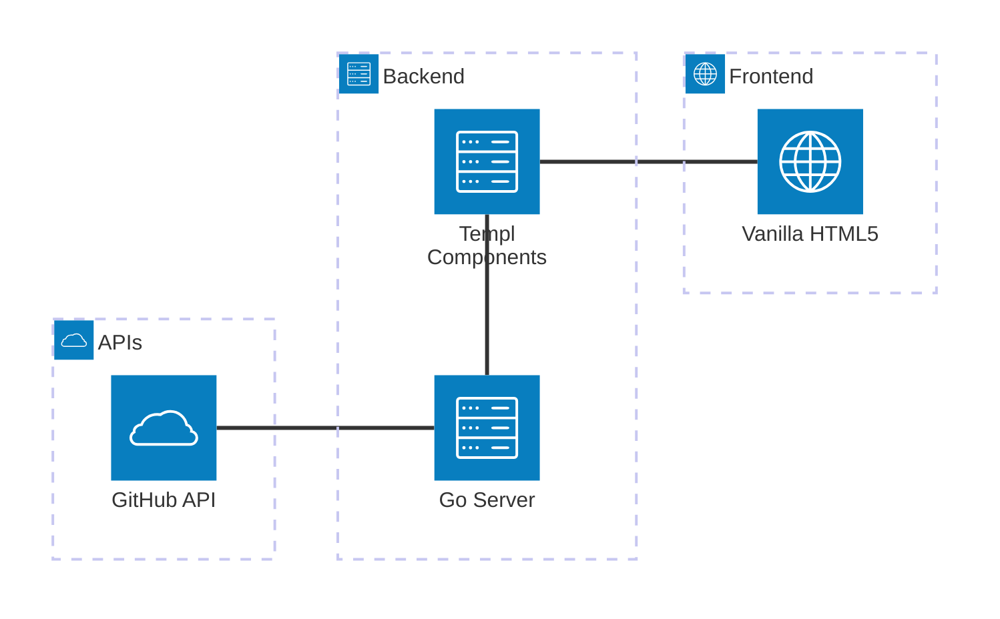

```mermaid
architecture-beta
    group frontend(internet)[Frontend]

    service client(internet)[Vanilla HTML5] in frontend

    group backend(server)[Backend]

    service server(server)[Go Server] in backend
    service templ(server)[Templ Components] in backend

    group api(cloud)[APIs]

    service github(cloud)[GitHub API] in api

    client:L -- R:templ
    templ:B -- T:server
    server:L -- R:github
```
